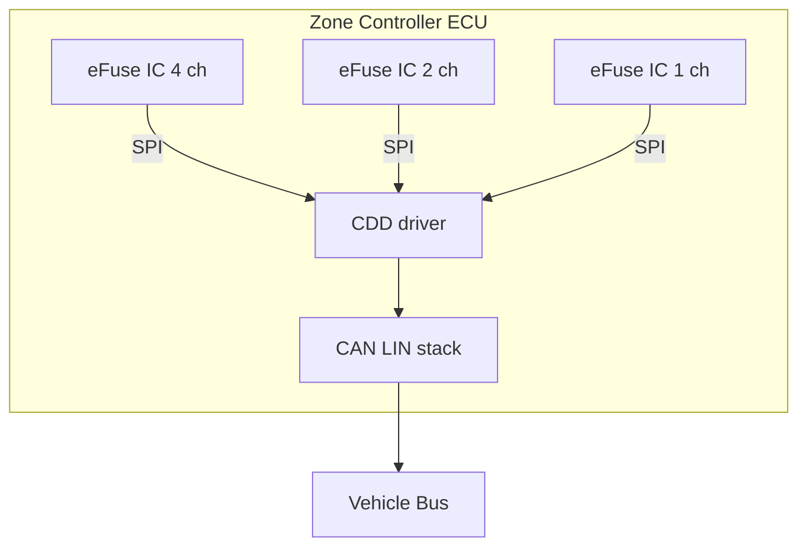
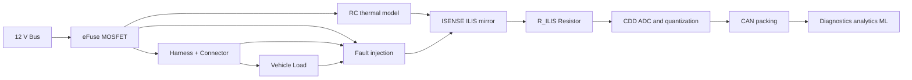
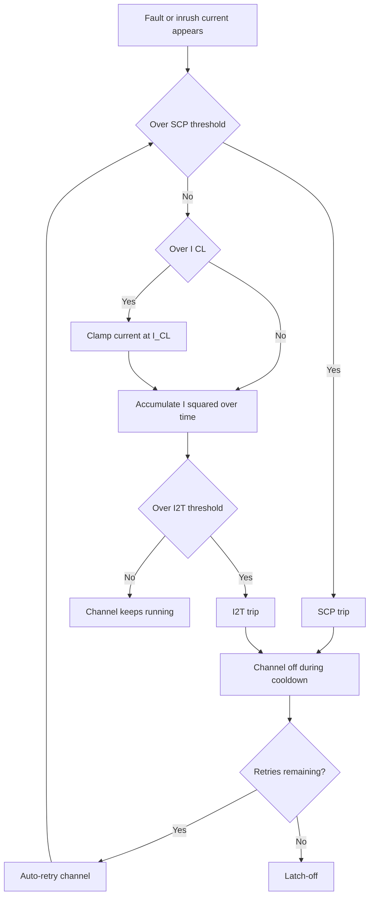
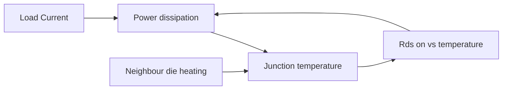

# eFuse Domain Reference

This document is for **hardware engineers, protection algorithm developers, and test bench engineers** who need to understand the physical domain modelled by this generator. It bridges the gap between real eFuse hardware and the synthetic signals the tool produces.

If you are looking for how to *configure* the tool, see [configuration.md](configuration.md). For output file schemas, see [data-model.md](data-model.md).

---

## 1. What Is an eFuse?

An **electronic fuse (eFuse)** is a solid-state power switch that replaces traditional blade fuses in automotive electrical distribution. eFuse ICs integrate:

- A **power MOSFET** (high-side or low-side, depending on topology) that switches the load
- A **current-sense mirror (ISENSE / ILIS)** that outputs a scaled copy of load current to an external ADC
- An **on-die temperature sensor** for junction temperature monitoring
- A **protection state machine** implementing SCP, F(i,t), thermal shutdown, and open-load diagnostics
- An **SPI register interface** that the host microcontroller (Zone Controller) reads for status, diagnostics, and configuration

### Key IC Families Modelled

The generator includes parametric models for **19 production IC families**:

| Manufacturer | Family | Part Number | Rating | Rds,on | Channels |
|---|---|---|---|---|---|
| Infineon | PROFET+2 | BTS7040-1EPA | 2.8 A | 40 mΩ | 1 |
| Infineon | PROFET+2 | BTS7020-2EPA | 5.5 A | 20 mΩ | 2 |
| Infineon | PROFET+2 | BTS7012-1EPA | 9 A | 12 mΩ | 1 |
| Infineon | PROFET+2 | BTS7008-2EPA | 11 A | 8 mΩ | 2 |
| Infineon | PROFET+2 | BTS7006-1EPA | 14 A | 6 mΩ | 1 |
| Infineon | PROFET+2 | BTS7004-1EPA | 18 A | 4 mΩ | 1 |
| Infineon | PROFET+2 | BTS7002-1EPA | 28 A | 2 mΩ | 1 |
| Infineon | PROFET+2 | BTS70041-1ESP | 4 A | 41 mΩ | 1 |
| Infineon | PROFET+2 | BTS70061-1ESP | 6 A | 61 mΩ | 1 |
| Infineon | PROFET+2 | BTS70081-2ESP | 8 A | 81 mΩ | 2 |
| Infineon | TLE multi-channel | TLE9104SH | 10 A | 15 mΩ | 4 |
| Infineon | BTS high-current | BTS81000 | 100 A | 1.2 mΩ | 1 |
| ST | VIPower HS | VN7140AJ | 14 A | 30 mΩ | 1 |
| ST | VIPower Dual | VND7020AJ | 20 A | 20 mΩ | 2 |
| ST | VIPower H-Bridge | VNH7013AY | 30 A | 13 mΩ | 1 |
| ST | VIPower Low-Side | VNL5050 | 50 A | 5 mΩ | 1 |
| ST | VIPower Dual | VND5025 | 25 A | 5 mΩ | 2 |
| — | CUSTOM | — | User-defined | User-defined | — |
| — | GENERIC | — | Safe defaults | 10 mΩ | — |

Each entry defines: Rds,on, I_max, I_trip ranges, k_ILIS current-sense ratio, ADC resolution, blanking time, retry count, F(i,t) threshold, and thermal parameters. See `efuse_datagen/config/catalog.py` for the full `EFUSE_CATALOG` dictionary.

---

## 2. Zone Controller Architecture

Modern BEVs replace the central fuse box with distributed **Zone Controllers** (ZCs) — one per physical vehicle zone. Each ZC is an ECU containing:



Inside the ECU, the CDD reads current, temperature, and diagnostic status from each eFuse IC over SPI, then publishes application-visible telemetry over the in-vehicle network.

**Signal chain in the real vehicle:**

1. **Load draws current** through the eFuse MOSFET
2. **ISENSE current mirror** produces I_ILIS = I_load / k_ILIS
3. **R_ILIS resistor** converts I_ILIS to a voltage: V_sense = I_ILIS × R_ILIS
4. **CDD ADC** samples V_sense and converts back to current using configured k_ILIS and R_ILIS
5. **CAN packing** quantises the physical value into a scaled integer (e.g. 16-bit, 0.01 A/bit resolution)
6. **Application-layer consumers** (diagnostic tools, analytics, ML models) see the CAN-packed value

The generator models **every stage** of this chain, including:
- k_ILIS unit-to-unit scatter (±15%) and temperature drift (ppm/°C)
- R_ILIS manufacturing tolerance (±20% default)
- ADC quantization noise (12-bit current, 10-bit voltage default)
- CAN signal packing quantization (0.01 A/bit, 0.01 V/bit default)

### Default 4-Zone BEV Topology (65 Channels)

| Zone | Channels | Example Loads |
|------|----------|---------------|
| `zone_front` | 18 | Headlamps, HVAC blower, wiper motor, washer pump, charger, horn |
| `zone_rear` | 17 | Tail lights, seat heaters, defroster, rear dampers, charge port |
| `zone_body` | 15 | Door locks, windows, mirrors, sunroof, trunk, keyless entry |
| `zone_central` | 15 | Main PDU, battery disconnect, DC/DC converter, ADAS PSU |

---

## 3. Signal Chain Model

The generator synthesises signals through an 10-stage pipeline per channel:



The diagram above shows the path that matters to downstream consumers: physical load current flows through the MOSFET and harness, faults perturb that path, the ISENSE chain converts it into an ADC-visible quantity, and CAN packing imposes the final resolution limit seen by software.

For a stakeholder-oriented summary with a worked example, see [signal-chain-one-pager.md](signal-chain-one-pager.md).

### Stage 1 — Bus Voltage

A shared 12 V bus voltage trace models:
- Slow battery state-of-charge drift (0.05–0.3 Hz)
- Minor load-variation ripple (0.1–0.5 Hz)
- White ADC/harness noise floor (σ = 20 mV)

The 50 Hz alternator ripple is **not** modelled because at CAN sample rates (100 ms = 10 Hz), the 50 Hz component is above Nyquist and would appear as misleading aliasing artefacts.

### Stage 2 — Nominal Current + Composite Noise

```
I_base = I_nominal + noise_pink + noise_adc + noise_thermal + noise_emi
```

- **Pink (1/f) noise** — spectral shaping of white noise by 1/f^α (α configurable, default 1.0)
- **ADC quantization** — uniform ±LSB/2 noise based on `current_adc_bits`
- **Thermal (Johnson-Nyquist)** — σ scales with √(T_junction/298 K)
- **EMI spikes** — Bernoulli process (0.5% probability per sample), ±`emi_amplitude_a`

### Stage 3 — Load Turn-On Transient (Inrush)

Load-type-specific inrush profiles:

| Load Type | Inrush Factor | Duration | Shape |
|---|---|---|---|
| `resistive` | 1× (none) | — | — |
| `motor` | 5× | 50 ms | Exponential decay |
| `inductive` | 3× | 20 ms | Exponential decay |
| `ptc` | 2× | 500 ms | Slow exponential decay |
| `capacitive` | 8× | 10 ms | Fast RC discharge |

Custom inrush via `inrush_factor` and `inrush_duration_ms` per channel.

### Stage 4 — Voltage from Bus - Harness Drop

```
V_load = V_bus - I_load × (R_harness + R_connector) + noise
```

`harness_r_ohm` (default 20 mΩ) and `connector_r_ohm` (default 10 mΩ) model the series resistance of the wiring loom and crimp terminals between the eFuse output and the load.

### Stage 5 — Power-State Gating

Channels are energised or gated off based on the vehicle's power state and the channel's `power_class`:

| Power Class | KL30 (ALWAYS_ON) | KL15 (IGNITION) | KLR (ACCESSORY) | KL50 (START) |
|---|---|---|---|---|
| SLEEP | Dark current (µA) | Off | Off | Off |
| CRANK | Dark current (µA) | Off | Off | **ON** |
| ACTIVE | **ON** | **ON** | **ON** | Off |
| ACCESSORY | Dark current (µA) | Off | **ON** | Off |

Wake transitions (SLEEP → ACTIVE) inject a configurable inrush pulse.

### Stage 6 — Duty-Cycle Gating

Intermittent loads (wipers, heaters, door locks) cycle on/off:
- **Explicit burst mode**: `on_duration_s` / `off_duration_s` defines a square-wave pattern
- **Probabilistic mode**: `duty_cycle` (0–1) gates random blocks (exponential block length, mean 2 s)

### Stage 7 — Fault Waveform Injection

See [Section 5: Fault Catalog](#5-fault-catalog) for the 16 supported fault types.

### Stage 8 — RC Thermal Model

First-order RC model with temperature-dependent Rds,on positive feedback:

$$T_j(n) = T_j(n-1) + \frac{\Delta t}{\tau_{th}} \cdot \left[ T_{amb} + P(n) \cdot R_{th} - T_j(n-1) \right]$$

Where:
- $P(n) = I_{load}^2 \times R_{ds,on}(T_j)$ — power dissipated in the MOSFET
- $R_{ds,on}(T_j) = R_{ds,on}(25°C) \times (T_{j,K} / 300)^n$ — PROFET+2 / VIPower power-law tempco (n ≈ 2.3)
- $\tau_{th} = R_{th} \times C_{th}$ — thermal time constant (8–20 s typical)
- $R_{th}$ — junction-to-ambient thermal resistance (40–90 °C/W typical for TO-252 packages)

This correctly models the positive feedback loop: more current → more heat → higher Rds,on → more power → more heat.

For **multi-channel ICs** (e.g. TLE9104SH 4-channel), channels sharing the same `die_id` exchange heat via `thermal_coupling_coeff` (10–25% of neighbour ΔT injected).

### Stage 9 — ISENSE Sensing Chain

Converts physical current to the value the CDD ADC reports:

$$I_{reported} = I_{load} \times (1 + \delta_R) \times (1 + \delta_k) \times \left[1 + \alpha_k \times (T_j - 25)\right]$$

Where:
- $\delta_R \sim U(\pm r_{ILIS\_tolerance})$ — R_ILIS manufacturing scatter (frozen per unit)
- $\delta_k \sim U(\pm 0.15)$ — k_ILIS unit-to-unit variation (frozen per unit)
- $\alpha_k = k_{ILIS\_tempco\_ppm\_C} \times 10^{-6}$ — dynamic temperature coefficient

Then **ADC quantization** (round to LSB) for both current and voltage channels.

### Stage 10 — CAN Signal Packing

CAN frames transmit physical values as scaled integers. This adds a **second quantization layer** on top of the ADC:

```
I_CAN = round(I_ADC / can_current_resolution_a) × can_current_resolution_a
V_CAN = round(V_ADC / can_voltage_resolution_v) × can_voltage_resolution_v
```

Default resolution: **0.01 A/bit** and **0.01 V/bit** (16-bit CAN signal words). This CAN packing dominates the final signal granularity visible to any off-board consumer.

- **CAN channels** (`source_protocol: can`): both ADC + CAN quantization applied
- **XCP channels** (`source_protocol: xcp`): only ADC quantization (DAQ rasters bypass CAN packing)
- Set `can_current_resolution_a: 0` to disable CAN packing

---

## 4. Protection Mechanisms

The generator models **three protection mechanisms** running in parallel, plus thermal shutdown and open-load diagnostics:



This flow is why `current_limit_a` matters: the generator does not jump directly from overload to trip. It first clamps the current when the IC would regulate, then lets the F(i,t) integral decide whether the overload is brief enough to tolerate or severe enough to shut down.

### 4.1 Short-Circuit Protection (SCP)

A fast analog comparator trips **immediately** when instantaneous current exceeds `short_circuit_threshold_a` (default: 3× `max_current_a`). Response time in real ICs: 3–10 µs.

After trip: channel off → cooldown → retry.

### 4.2 Current Limiting (I_CL)

When load current exceeds the IC's current-limit clamp level `current_limit_a` (default: 1.5× `fuse_rating_a`), the IC **actively regulates** the MOSFET gate to hold output current at I_CL.

Key behaviour:
- The F(i,t) energy integral **continues accumulating** during the clamp phase (because the IC is still dissipating P = I_CL² × Rds,on)
- Small regulation loop noise (±2% of I_CL) is added
- The load sees clamped current, not the full fault current
- If F(i,t) trips before the fault clears, the channel shuts off

This is the mechanism that lets an eFuse handle brief inrush spikes without tripping, while still protecting against sustained overloads.

### 4.3 F(i,t) Energy Integral (I²t)

Integrates squared overcurrent over time:

$$E(t) = \int_0^t I_{load}^2 \, dt$$

Trips when $E(t) \geq$ `fit_threshold_a2s` (default: `fuse_rating_a²` × 0.01 A²·s).

- Only accumulates when I > I_nominal
- Drains slowly when I < I_nominal (thermal dissipation from die)
- After trip: cooldown → retry → accumulator resets

### 4.4 Thermal Shutdown

If junction temperature (from RC thermal model) exceeds `thermal_shutdown_c` (default 150°C), the IC shuts off the channel. Resumes when T_j falls below (thermal_shutdown_c − 20°C hysteresis).

### 4.5 Open-Load Diagnostics

When `open_load` fault is active, current drops to near-zero leakage while the gate remains commanded ON. After `ol_blank_time_ms` (default 100 ms), the IC's DIAGNOSIS cycle confirms open load and sets the `OPEN_LOAD_DIAG` protection event.

### 4.6 Over-Voltage Protection

Triggered by `jump_start` (bus > 16 V) and `load_dump` (bus spike to ~40 V). The IC's internal clamp fires, and the `OVER_VOLTAGE` protection event is set.

### Retry and Latch-Off Sequence

After any protection trip:

```
TRIP → channel OFF → cooldown (cooldown_s, default 1 s)
     → AUTO-RETRY (gate back ON) → if fault persists → TRIP again
     → repeat up to max_retries (default 3)
     → if max_retries exceeded → LATCH_OFF (permanent off until host reset)
```

The `protection_event` column in telemetry output encodes exactly **which** mechanism fired: `scp`, `i2t`, `thermal_shutdown`, `latch_off`, `open_load_diag`, or `over_voltage`.

---

## 5. Fault Catalog

The generator supports **16 fault types**, each producing physically distinct waveform signatures:

```mermaid
flowchart TD
     faults[16 Fault Types]
     faults --> overcurrent[Overcurrent]
     faults --> voltage[Voltage Disturbance]
     faults --> aging[Degradation and aging]
     faults --> sensing[Sensing and comms]
     faults --> thermal[Thermal]
     faults --> powerstate[Power state]
     faults --> open[Open circuit]
     faults --> ground[Ground]

     overcurrent --> overload_spike[overload_spike]
     overcurrent --> intermittent_overload[intermittent_overload]
     overcurrent --> short_to_ground_1[short_to_ground]

     voltage --> voltage_sag[voltage_sag]
     voltage --> jump_start[jump_start]
     voltage --> load_dump[load_dump]
     voltage --> cold_crank[cold_crank]

     aging --> thermal_drift[thermal_drift]
     aging --> gradual_degradation[gradual_degradation]
     aging --> connector_aging[connector_aging]

     sensing --> noisy_sensor[noisy_sensor]
     sensing --> dropped_packet[dropped_packet]

     thermal --> thermal_coupling[thermal_coupling]
     powerstate --> wake_transient[wake_transient]
     open --> open_load[open_load]
     ground --> ground_offset[ground_offset]
     ground --> short_to_ground_2[short_to_ground]
```



The taxonomy matters because several faults can produce superficially similar current traces. The main discriminators are whether voltage moves with current, whether protection fires, and whether the effect is local to one channel or correlated across a shared node or die.

### 5.1 Overcurrent Faults

| Fault | Root Cause | Waveform | Protection Response |
|-------|-----------|----------|-------------------|
| `overload_spike` | Stalled motor, dead short | Exponential rise to I_trip × intensity | SCP or F(i,t) trip → retry → latch-off |
| `intermittent_overload` | Loose connector under vibration | Damped oscillation bursts | Warning when I > 0.9 × fuse_rating |
| `short_to_ground` | Wire chafing through insulation to chassis | I = V_bus / (Rds,on + R_stg), V_load ≈ 0 V | SCP or F(i,t) trip → retry → latch-off |

**`short_to_ground` detail:** The load output wire contacts chassis GND through a low-resistance path `stg_resistance_ohm` (default 50 mΩ). Fault current rockets to V_bus / (Rds,on + R_stg) and load voltage collapses to near 0 V. The **simultaneous** current spike + voltage collapse is the key diagnostic differentiator from `overload_spike` (which has elevated voltage). Protection fires within microseconds to milliseconds. Each auto-retry sees the same STG fault → eventual latch-off.

### 5.2 Voltage Disturbance Faults

| Fault | Root Cause | Waveform | Observable |
|-------|-----------|----------|-----------|
| `voltage_sag` | Heavy auxiliary load, weak battery | Exponential bus voltage drop | V drops 30% × intensity |
| `jump_start` | External booster connected | Bus rises to 16–24 V, ramp up/down | Over-voltage event when V > 16 V |
| `load_dump` | Alternator field collapse (ISO 16750-2) | Bus spikes to ~40 V, exp decay | IC clamp fires, channel shuts off |
| `cold_crank` | Starter motor engagement | Bus sags to 7–9 V for 3–5 s (U-shape) | Under-voltage warning when V < 9 V |

### 5.3 Degradation & Aging Faults

| Fault | Root Cause | Waveform | Time Scale |
|-------|-----------|----------|-----------|
| `thermal_drift` | Insulation breakdown, leakage increase | Gradual linear current ramp | Minutes (simulated) / weeks (real) |
| `gradual_degradation` | Component aging, winding breakdown | Slow exponential current ramp, PWM reduction | Minutes (simulated) / months (real) |
| `connector_aging` | Fretting corrosion on pin contacts | R_c(t) = R_c0 × (1 + k × t²), V_load drops | Progressive across drive cycles |

### 5.4 Sensing & Communication Faults

| Fault | Root Cause | Waveform | Observable |
|-------|-----------|----------|-----------|
| `noisy_sensor` | EMI from nearby inverter/motor | High-frequency burst noise on I/V | Damped oscillation envelope |
| `dropped_packet` | CAN bus overload, DTC handling | 40% of samples → NaN | Missing data windows |

### 5.5 Thermal Faults

| Fault | Root Cause | Waveform | Observable |
|-------|-----------|----------|-----------|
| `thermal_coupling` | Adjacent channel on shared die dissipating high power | Gentle temperature rise from neighbour | T_j rises without local current increase |

### 5.6 Power-State Faults

| Fault | Root Cause | Waveform | Observable |
|-------|-----------|----------|-----------|
| `wake_transient` | Abnormal SLEEP→ACTIVE inrush (capacitive load) | Current spike above nominal at wake edge | Brief overcurrent at power-on |

### 5.7 Open-Circuit Faults

| Fault | Root Cause | Waveform | Observable |
|-------|-----------|----------|-----------|
| `open_load` | Wire break, terminal corrosion, connector pull-out | I ≈ 0 while gate ON, DIAG flag after blank time | Near-zero current with ON state |

### 5.8 Ground Faults

| Fault | Root Cause | Waveform | Observable |
|-------|-----------|----------|-----------|
| `ground_offset` | Corroded GND bond, damaged GND strap, insufficient stitch points | GND node rises: V and I biased high, ramp over fault window | Uniform offset across all channels on same GND node |
| `short_to_ground` | Wire insulation chafing against chassis member | Fault current V_bus/(Rds+R_stg), voltage collapse to ~0 V | Simultaneous I spike + V collapse, protection trip |

**`ground_offset` detail:** The GND reference potential rises by V_gnd = I_total × R_gnd due to corroded ground connections. All voltage and current readings from channels on the same ECU node appear offset upward. The offset ramps from 0 to `ground_offset_max_v` × intensity (default max 2 V). This fault does **not** trip eFuse protection — it is a measurement bias, not an overcurrent. A hardware engineer would recognise it by the **correlated offset** across multiple channels.

---

## 6. Wiring Harness Model

The series path from eFuse output to load includes:


Series resistance is distributed across that path: `Rds,on` inside the IC, `harness_r_ohm` in the loom, and `connector_r_ohm` in the mating terminals.

- `harness_r_ohm` (default 20 mΩ) — wire resistance, scales with length and gauge
- `connector_r_ohm` (default 10 mΩ) — crimp terminal + housing contact resistance

The voltage at the load is:

$$V_{load} = V_{bus} - I_{load} \times (R_{ds,on} + R_{harness} + R_{connector})$$

The `connector_aging` fault models fretting corrosion that increases R_connector over time: $R_c(t) = R_{c0} \times (1 + k \times t^2)$, where k scales with fault intensity.

---

## 7. Thermal Model Details



This positive feedback loop is the core reason the thermal model cannot be replaced by a static temperature offset. Once junction temperature rises, Rds,on rises with it, which increases power dissipation again.

### Junction Temperature

$$T_j(n) = T_j(n-1) + \alpha \times \left[ T_{amb} + I_{load}^2 \times R_{ds,on}(T_j) \times R_{th} - T_j(n-1) \right]$$

Where $\alpha = \Delta t / \tau_{th}$ is the discrete time constant.

### Temperature-Dependent Rds,on

$$R_{ds,on}(T_j) = R_{ds,on}(25°C) \times \left(\frac{T_{j,K}}{300}\right)^n$$

Exponent n (`rds_on_tempco_exp`, default 2.3) captures the MOSFET carrier mobility degradation with temperature. This creates the **positive thermal feedback loop** that is critical for accurate F(i,t) modelling.

### Die Thermal Coupling

Multi-channel eFuse ICs (e.g. TLE9104SH 4-channel) share a silicon die. Channels with the same `die_id` string exchange heat:

$$\Delta T_{coupled,i} = k_{th} \times \sum_{j \neq i} (T_{j,j} - T_{amb,j})$$

Where $k_{th}$ = `thermal_coupling_coeff` (default 0.15, range 0.10–0.25 for PROFET+2-class devices).

---

## 8. How the Simulator Maps to Real Hardware

| Real Vehicle | Simulator Equivalent |
|---|---|
| eFuse IC SPI register read | `ChannelMeta` fields + protection state machine |
| ISENSE ADC sample | `_apply_isense_chain()` with k_ILIS drift + R_ILIS tolerance |
| CAN signal database (.dbc) | `can_current_resolution_a` / `can_voltage_resolution_v` packing |
| Current-limiting mode (I_CL) | `_apply_protection()` I_CL clamp before F(i,t) trip |
| F(i,t) trip counter | `reset_counter` column + `protection_event` = `i2t` |
| SCP fast comparator | `short_circuit_threshold_a` → instant trip |
| Thermal shutdown flag in SPI status | `protection_event` = `thermal_shutdown` when T_j > threshold |
| Open-load DIAGNOSIS cycle | `protection_event` = `open_load_diag` after `ol_blank_time_ms` |
| Wire harness voltage drop | `harness_r_ohm` + `connector_r_ohm` series resistance |
| Ground bond corrosion (field returns) | `ground_offset` fault: GND node potential shift |
| Wire-to-chassis short (top-3 warranty cause) | `short_to_ground` fault: I = V_bus/(Rds+R_stg), V ≈ 0 |
| Connector fretting (progressive) | `connector_aging` fault: R_c(t) = R_c0 × (1 + k × t²) |

---

## 9. Standards and Reference Material

| Standard / Source | Relevance |
|---|---|
| ISO 16750-2 | Load dump (40 V spike), cold crank profiles, jump start voltage ranges |
| ISO 11452 | EMI immunity — basis for EMI noise injection model |
| Infineon PROFET+2 application note (AN601) | k_ILIS behaviour, Rds,on tempco, F(i,t) integral definition |
| Infineon TLE9104SH datasheet | Multi-channel die thermal coupling, SPI register layout |
| ST VIPower user manual (UM2718) | VN/VND/VNH protection sequences, ISENSE accuracy bands |
| SAE J1455 | Recommended environmental conditions for automotive electronics |

---

## 10. Glossary

| Term | Definition |
|---|---|
| **CDD** | Complex Device Driver — AUTOSAR software component that interfaces with eFuse IC hardware via SPI |
| **F(i,t)** | Energy integral protection: ∫ I² dt. Trips when accumulated energy exceeds threshold. Allows brief inrush but catches sustained overloads |
| **I_CL** | Current-limiting clamp level. IC regulates MOSFET gate to hold output at I_CL instead of allowing unlimited fault current |
| **ISENSE / ILIS** | Current-sense mirror output. The IC produces I_ILIS = I_load / k_ILIS; an external resistor R_ILIS converts this to a voltage for ADC sampling |
| **k_ILIS** | Current-sense ratio (e.g. 5000:1). Subject to ±15% unit-to-unit variation and temperature drift |
| **KL15 / KL30 / KLR / KL50** | German automotive terminal designations: KL30 = permanent battery, KL15 = ignition, KLR = accessory, KL50 = starter |
| **Latch-off** | Permanent channel shutdown after max_retries exceeded. Requires host MCU reset to clear |
| **R_ILIS** | ISENSE sense resistor (typ. 1.2 kΩ). Manufacturing tolerance (±20%) causes a frozen gain offset per unit |
| **Rds,on** | MOSFET drain-source on-resistance. Temperature-dependent: R(T) = R(25°C) × (T_K/300)^n |
| **SCP** | Short Circuit Protection — fast analog comparator, trips in 3–10 µs when I > threshold |
| **STG** | Short-To-Ground — fault where output wire contacts chassis GND through low resistance |
| **Zone Controller (ZC)** | Distributed ECU hosting eFuse ICs for one physical vehicle zone (front, rear, body, central) |
