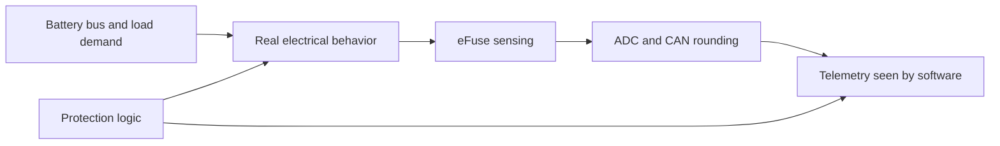

# Signal Chain One-Pager

This page explains the signal-chain model in business terms for stakeholders who need to understand **what the generator represents**, **why it matters**, and **what kinds of insights it enables**.

---

## Executive Summary

The generator does not emit ideal lab signals. It emits the kind of telemetry a real vehicle ECU would publish after:

- real electrical behavior at the load,
- real sensing imperfections inside the eFuse IC,
- real network quantization on CAN, and
- real protection interventions when conditions go unsafe.

That is why the output is useful for stakeholder demos, analytics development, protection strategy reviews, and early algorithm validation.

In one sentence:

> **We start with how the hardware behaves, then model how the ECU measures and reports it, so the final dataset looks like real vehicle telemetry rather than clean physics-only simulation.**

---

## Mental Model

For business stakeholders, the signal chain is a simple 5-step story:

1. **Power is delivered**
   The battery bus feeds an eFuse channel, which powers a vehicle load such as a seat heater, lamp, or pump.

2. **Physics changes the signal**
   Current draw, harness resistance, connector resistance, inrush, ambient temperature, and faults all influence what the load actually experiences.

3. **The eFuse senses an imperfect version of reality**
   The IC does not report raw physical current directly. It senses it through ISENSE/ILIS, which introduces gain error, temperature drift, and ADC rounding.

4. **The vehicle network simplifies it again**
   CAN packing converts the measured quantity into a scaled integer, so the final reported value is slightly coarser than the analog truth.

5. **Protection can intervene at any time**
   If current becomes too high, the IC may clamp it, trip it, retry it, or latch it off. The reported telemetry therefore reflects both load behavior and protection behavior.

---

## Why This Matters

If we only simulated the raw physics, the output would be too clean and would mislead downstream teams. In the real vehicle:

- sensor paths add noise and gain error,
- CAN transport limits resolution,
- protection logic changes the waveform during abnormal events,
- and many field issues appear as slow drift rather than dramatic failures.

This model is therefore closer to what stakeholders care about:

- what engineers will actually debug,
- what dashboards will actually display,
- what analytics will actually ingest,
- and what product teams will actually see in reviews.

---

## Worked Example

### Example Channel: Seat Heater

Assume a seat heater channel with:

- Nominal current: **8.0 A**
- Bus voltage: **13.5 V**
- Harness + connector resistance: **30 mΩ**
- Current ADC: **12-bit**
- CAN packing resolution: **0.01 A/bit**

### Normal Operation

1. The seat heater requests about **8.0 A**.
2. The wiring path drops some voltage:

   $$V_{drop} = I \times R = 8.0 \times 0.03 = 0.24\,V$$

3. The load sees about:

   $$V_{load} = 13.5 - 0.24 = 13.26\,V$$

4. The eFuse senses that current through the ILIS mirror and ADC.
5. CAN packing rounds the reported current to the nearest **0.01 A**.

So downstream software may see **7.99 A**, **8.00 A**, or **8.01 A** rather than a perfectly continuous analog value.

### Fault Case: Connector Aging

Now assume the connector degrades and contact resistance rises from **10 mΩ** to **150 mΩ**.

What happens:

1. Total series resistance increases.
2. Voltage drop across the path rises.
3. The seat heater sees less voltage.
4. Current may fall slightly for a resistive load.
5. The telemetry changes in a subtle but persistent way.

What stakeholders would observe in the data:

- lower `voltage_v`,
- slightly lower or drifting `current_a`,
- no immediate SCP trip,
- a progressive degradation signature that analytics can detect before a hard failure occurs.

This is important because many real warranty and service issues look exactly like this: **not a sudden catastrophic failure, but a slow loss of electrical quality that becomes diagnosable only when the telemetry is realistic enough.**

---

## What the Signal Chain Delivers to the Business

| Stakeholder Need | Why the Signal Chain Model Helps |
|---|---|
| Product demo realism | Signals look like vehicle telemetry, not synthetic lab-perfect traces |
| Analytics development | Models can be trained on realistic noise, drift, and protection behavior |
| Protection strategy reviews | Teams can see how SCP, current limiting, and retry logic shape reported behavior |
| Fault storytelling | Slow degradation, voltage collapse, and trip events become explainable to non-experts |
| Early validation before hardware | Teams can explore behavior months before full bench or fleet data is available |

---

## Key Takeaway

The signal-chain model is valuable because it connects **hardware reality** to **business-visible telemetry**.

It answers the stakeholder question:

> **"If this happened in a real vehicle, what would our software, dashboards, and analytics actually see?"**

That is the core purpose of this model.